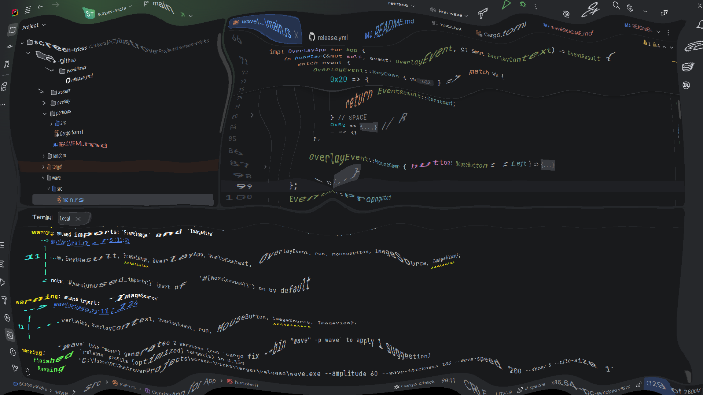

# Screen Waves simulator




# Usage
```cmd
git clone https://github.com/hananel42/screen-tricks.git
cd screen-tricks
cargo run --release -p wave
```

the exe file will be found at `target/release/wave.exe`

Command line args:
```
  --tile-size <int>        Size of distortion tiles (default: 8)
  --wave-speed <float>     Speed of the wave in px/s (default: 600.0)
  --wave-thickness <float> Thickness of the wave ripple (default: 60.0)
  --amplitude <float>      Max distortion amplitude (default: 30.0)
  --decay <float>          How fast the wave fades out (default: 40.0)
  -r, --random             Generate random ripple characteristics
  -h, --help               Print this help message
```


the example shown above :
```cmd
wave.exe --amplitude 60 --wave-thickness 100 --wave-speed 200 --decay 5 --tile-size 1
```